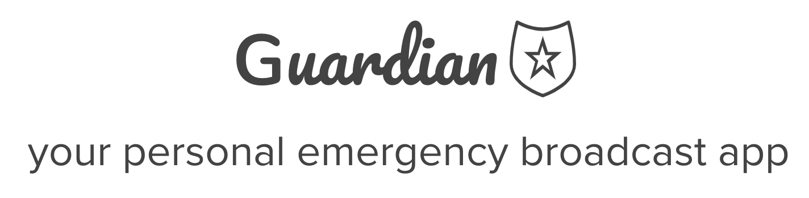

  
# Guardian: Your personal emergency broadcast system
2019 AngelHack Hackathon - Seattle, WA

### Motivation
According to FBI statistics, violent crime in the Seattle area is currently over 65% higher than the national average. Over 61% of women regularly take steps to avoid being sexually assaulted according to YouGov surveys. How can we take steps to make people feel safe and secure?

#### Team
* Abhi Banerjee
* Diane Chiang
* Earl Jay Caoile
* Brandon Yu
* Adrienne Lim

### Our Project
Guardian is your personal emergency broadcast system that allows you to send text alerts to your closest friends & family with your location and a link to a live video broadcast during a stressful encounter. It uses the Agora RTC platform in conjunction with Machine Learning & Deep Learning modules in AWS and Keras to provide a platform for multimodal sentiment analysis for legal cadence.

### Unique Features
* Facial Expression Sentiment Analysis via AWS Rekognition
* Real-time video broadcasting to your friends & family
* Video to Audio via ffmpeg (Python)
* Audio to Text via AWS Transcribe
* Text Sentiment Classifer using RNN via Keras (Python)

### Links
- Presentation Slides: --
- GitHub: https://github.com/drunkONdata/guardian

### Future Work
* Validate multimodal sentiment models with labeled datasets to establish baseline accuracy
* Deploy "Descrete" mode to broadcast audio or video
* Leverage data analytics platform to drive crime reporting
* Utilize AWS Kinesis module to handle live video stream
* Leverage Amazon Comprehend's Text Sentiment
